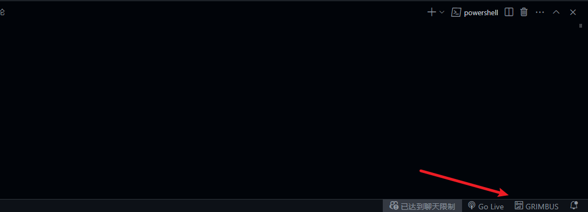

# Meme Price Checker

A VSCode extension for checking cryptocurrency prices on Solana and Base chains directly within the editor.

## Demo

<div align="center">
  
  
</div>

> 左图展示了代币展示位置，右图展示了价格趋势和交易量信息

## Features

- Quick token price lookup within VSCode
- Real-time price updates
- Support for Solana and Base chains
- Price trend indicators (5min, 1h, 6h, 24h)
- Trading volume and liquidity information

## Installation

1. Search for "Meme Price Checker" in the VSCode Extension Marketplace
2. Click Install

## Usage

### Commands

- `Check Token Price`: View token prices

  - Windows/Linux: `Ctrl+Shift+M`
  - macOS: `Cmd+Shift+M`

- `Refresh Token Price`: Update token prices
  - Windows/Linux: `Ctrl+Shift+R`
  - macOS: `Cmd+Shift+R`

## Development

### Prerequisites

- [Bun](https://bun.sh) v1.2.0 or higher
- VSCode v1.85.0 or higher

### Install Dependencies

```bash
bun install
```

### Compile

```bash
bun run compile
```

### Run and Debug

Press `F5` in VSCode to start debugging mode.

## Data Source

Price data is fetched through the DexScreener API.

## License

MIT
